# VR + ARX R5 bimanual teleoperation 
## Reference
1. 00-readme/00-配置CAN手册.pdf
2. 00-readme/04-R5-ROS-aloha.pdf (ubuntu 20.04)
3. 00-readme/05-R5-ROS2-aloha.pdf (ubuntu 22.04)
## Hardware Connection
### ARX R5


1. 电源线连接
2. CAN转USB， 白色的`type-c`转`USB`线，尽量用原装线，否则可能导致无法连接

### VR
1. VR串口通讯设备
2. 1根白色的双头`type-c`线和一根白色的`type-c`线转usb口

#### charge


#### communication
see `4. VR connection` for more details

## 1. Environment Setting
### ROS2
system requirement: `Ubuntu 22.04 + ROS humble`
```
wget http://fishros.com/install -O fishros && . fishros
```
### Conda
```
conda create -n arx python=3.8 
```
```
conda activate arx # activate environment
sudo apt install git vim
pip install empy==3.3.4 catkin_pkg lark pyyaml numpy
python3 -m pip install --upgrade numpy # install the numpy
```
#### autoactivate conda environment
- bash
```
echo "conda activate arx" >> ~/.bashrc
source ~/.bashrc
```
- zsh
```
echo "conda activate arx" >> ~/.zshrc
source ~/.zshrc
python --version # check python version whether 3.8 or not
```
## 2. Download
```
mkdir ~/ARX && cd ~/ARX
git clone https://github.com/ChangerC77/R5.git 
```
## 3. 配置CAN
### 1. 环境依赖
```
sudo apt install can-utils
sudo apt install net-tools
```
### 2. ARX_CAN文件夹
```
├── arx_can
│   ├── arx_can0.sh
│   ├── arx_can1.sh
│   ├── arx_can2.sh
│   ├── arx_can3.sh
│   └── arx_can5.sh
├── arx_can.rules
├── can.sh
├── search.sh
└── set.sh

1 directory, 9 files
```
这些文件是配置can和打开can的，用来让SDK通过can与机器人通信。
```
整个过程分4步
1、执行search.sh
2、修改arx_can.rules
3、执行set.sh
4、执行can.sh
```
### 3. C-VR双臂CAN设置
在使用两台臂（VR+两从臂）进行数据采集时，需要用到`“arx_can.rules”`文件中的`can1` 和 `can3`。
#### 1. 执行search.sh
搜索CAN设备（黑色can板）的ID，<font color=#FF0000 >注意要把USB插入电脑才能搜索到，且一次只能插入一个USB!!!</font> 除键鼠
```
cd ~/ARX/R5/ARX_CAN
./search.sh
```
##### 1. left arm
先将左臂与电脑连接，执行`search.sh`配置`arxcan1`
```
cd ~/ARX/ARX_R5/ARX_CAN
./search.sh # 若无法运行则执行：sh search.sh
```
然后终端会显示（不同的can设备显示的ID不同，下图的ID号只是一个例子）​
```
lsusb
```
output
```
    ATTRS{serial}=="207B32AE5052"
    ATTRS{serial}=="0000:00:14.0"
```
##### 2. right arm
拔出左臂usb，将右臂与电脑连接，执行`search.sh` 设置右臂`arxcan3` 的配置
```
cd ~/ARX/ARX_R5/ARX_CAN
./search.sh # 若无法运行则执行：sh search.sh
```
output
```
    ATTRS{serial}=="206A32B75052"
    ATTRS{serial}=="0000:00:14.0"
```
#### 2. arx_can.rules
```
sudo vim arx_can.rules
```
> 左右臂分别对应arxcan1和arxcan3
```
SUBSYSTEM=="tty", ATTRS{idVendor}=="16d0", ATTRS{idProduct}=="117e", ATTRS{serial}=="207B32AE5052", SYMLINK+="arxcan1"
SUBSYSTEM=="tty", ATTRS{idVendor}=="16d0", ATTRS{idProduct}=="117e", ATTRS{serial}=="206A32B75052", SYMLINK+="arxcan3"
```
#### 3. set.sh
```
cd ~/ARX/R5/ARX_CAN
./set.sh
```
输入密码后出现类似窗口：只要没报错就行。
```
root@pc-MS-7D89:/home/pc/ARX/ARX_R5/ARX_CAN# 
```
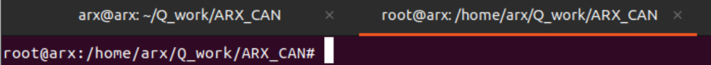

`以上操作仅在第一次运行程序前进行，只要can设备不更改，以后及无需再次配置。`
#### 4. set.sh

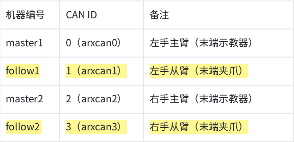

##### left arm
```
cd ~/ARX/R5/ARX_CAN/arx_can
./arx_can1.sh
```
##### right arm
```
cd ~/ARX/R5/ARX_CAN/arx_can
./arx_can3.sh
```
如果关掉上述窗口，can口不会关闭。
如果不关，这些脚本会有自动重连功能，可以自己拔掉usb再插上试试。
# 4. VR connection
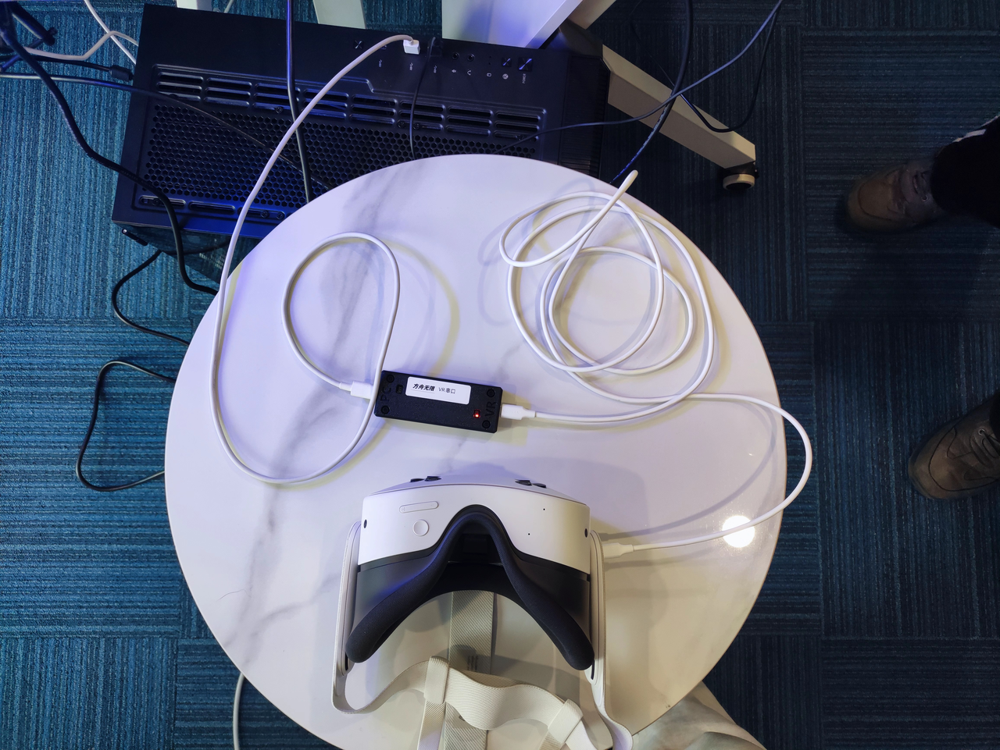
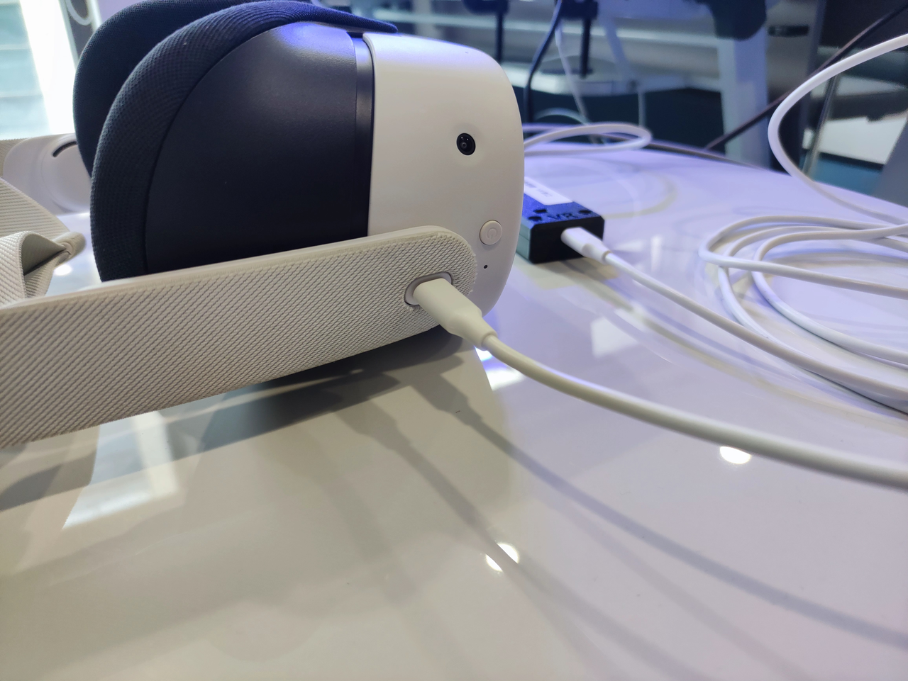

VR的连接方式如上图所示
连接后要看VR串口线是否亮起

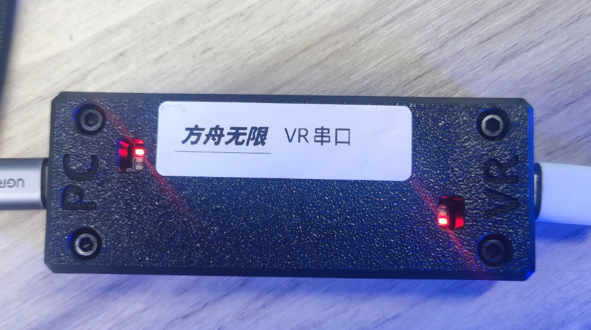

## check the port
```
ls /dev/ttyACM*
```
output
```
/dev/ttyACM0  /dev/ttyACM2  /dev/ttyACM3
``` 
# 5. 3rd libraries
## pybind11 (ubuntu 22.04)
### 1. download code
```
git clone https://github.com/ChangerC77/pybind11.git && cd pybind11 && mkdir build
```
Download `pybind11` successfully and generate buildfile. It will output the information below
output
```
Cloning into 'pybind11'...
remote: Enumerating objects: 30196, done.
remote: Counting objects: 100% (781/781), done.
remote: Compressing objects: 100% (408/408), done.
remote: Total 30196 (delta 625), reused 374 (delta 371), pack-reused 29415 (from 4)
Receiving objects: 100% (30196/30196), 12.28 MiB | 2.50 MiB/s, done.
Resolving deltas: 100% (21228/21228), done.
```
### 2. build
```
cd build && cmake ..
```
ouptut
```
-- The CXX compiler identification is GNU 11.4.0
-- Detecting CXX compiler ABI info
-- Detecting CXX compiler ABI info - done
-- Check for working CXX compiler: /usr/bin/c++ - skipped
-- Detecting CXX compile features
-- Detecting CXX compile features - done
-- pybind11 v3.0.0 dev1
-- CMake 3.22.1
-- Found Python: /home/tars/system/miniconda3/envs/arx/bin/python3.8 (found suitable version "3.8.20", minimum required is "3.8") found components: Interpreter Development.Module Development.Embed 
-- Python 3.8.20
Using compatibility mode for Python, set PYBIND11_FINDPYTHON to NEW/OLD to silence this message
-- Performing Test HAS_FLTO
-- Performing Test HAS_FLTO - Success
-- pybind11::lto enabled
-- pybind11::thin_lto enabled
-- Setting tests build type to MinSizeRel as none was specified
-- Building tests with Eigen v3.4.0
-- Found Boost: /usr/lib/x86_64-linux-gnu/cmake/Boost-1.74.0/BoostConfig.cmake (found suitable version "1.74.0", minimum required is "1.56")  
CMake Warning at tools/pybind11Common.cmake:275 (message):
  Missing: pytest 3.1

  Try: /home/tars/system/miniconda3/envs/arx/bin/python3.8 -m pip install
  pytest
Call Stack (most recent call first):
  tests/CMakeLists.txt:533 (pybind11_find_import)


-- Catch not detected. Interpreter tests will be skipped. Install Catch headers manually or use `cmake -DDOWNLOAD_CATCH=ON` to fetch them automatically.
-- Catch not detected. Interpreter tests will be skipped. Install Catch headers manually or use `cmake -DDOWNLOAD_CATCH=ON` to fetch them automatically.
-- Configuring done
-- Generating done
-- Build files have been written to: /home/tars/ARX/pybind11/build
```
```
make
```
output
```
[  1%] Building CXX object tests/CMakeFiles/pybind11_tests.dir/pybind11_tests.cpp.o
[  2%] Building CXX object tests/CMakeFiles/pybind11_tests.dir/test_async.cpp.o
[  3%] Building CXX object tests/CMakeFiles/pybind11_tests.dir/test_buffers.cpp.o
[  4%] Building CXX object tests/CMakeFiles/pybind11_tests.dir/test_builtin_casters.cpp.o
[  5%] Building CXX object tests/CMakeFiles/pybind11_tests.dir/test_call_policies.cpp.o
[  7%] Building CXX object tests/CMakeFiles/pybind11_tests.dir/test_callbacks.cpp.o
[  8%] Building CXX object tests/CMakeFiles/pybind11_tests.dir/test_chrono.cpp.o
[  9%] Building CXX object tests/CMakeFiles/pybind11_tests.dir/test_class.cpp.o
[ 10%] Building CXX object tests/CMakeFiles/pybind11_tests.dir/test_class_release_gil_before_calling_cpp_dtor.cpp.o
[ 11%] Building CXX object tests/CMakeFiles/pybind11_tests.dir/test_class_sh_basic.cpp.o
[ 12%] Building CXX object tests/CMakeFiles/pybind11_tests.dir/test_class_sh_disowning.cpp.o
[ 14%] Building CXX object tests/CMakeFiles/pybind11_tests.dir/test_class_sh_disowning_mi.cpp.o
[ 15%] Building CXX object tests/CMakeFiles/pybind11_tests.dir/test_class_sh_factory_constructors.cpp.o
[ 16%] Building CXX object tests/CMakeFiles/pybind11_tests.dir/test_class_sh_inheritance.cpp.o
[ 17%] Building CXX object tests/CMakeFiles/pybind11_tests.dir/test_class_sh_mi_thunks.cpp.o
[ 18%] Building CXX object tests/CMakeFiles/pybind11_tests.dir/test_class_sh_property.cpp.o
[ 20%] Building CXX object tests/CMakeFiles/pybind11_tests.dir/test_class_sh_property_non_owning.cpp.o
[ 21%] Building CXX object tests/CMakeFiles/pybind11_tests.dir/test_class_sh_shared_ptr_copy_move.cpp.o
[ 22%] Building CXX object tests/CMakeFiles/pybind11_tests.dir/test_class_sh_trampoline_basic.cpp.o
[ 23%] Building CXX object tests/CMakeFiles/pybind11_tests.dir/test_class_sh_trampoline_self_life_support.cpp.o
[ 24%] Building CXX object tests/CMakeFiles/pybind11_tests.dir/test_class_sh_trampoline_shared_from_this.cpp.o
[ 25%] Building CXX object tests/CMakeFiles/pybind11_tests.dir/test_class_sh_trampoline_shared_ptr_cpp_arg.cpp.o
[ 27%] Building CXX object tests/CMakeFiles/pybind11_tests.dir/test_class_sh_trampoline_unique_ptr.cpp.o
[ 28%] Building CXX object tests/CMakeFiles/pybind11_tests.dir/test_class_sh_unique_ptr_custom_deleter.cpp.o
[ 29%] Building CXX object tests/CMakeFiles/pybind11_tests.dir/test_class_sh_unique_ptr_member.cpp.o
[ 30%] Building CXX object tests/CMakeFiles/pybind11_tests.dir/test_class_sh_virtual_py_cpp_mix.cpp.o
[ 31%] Building CXX object tests/CMakeFiles/pybind11_tests.dir/test_const_name.cpp.o
[ 32%] Building CXX object tests/CMakeFiles/pybind11_tests.dir/test_constants_and_functions.cpp.o
[ 34%] Building CXX object tests/CMakeFiles/pybind11_tests.dir/test_copy_move.cpp.o
[ 35%] Building CXX object tests/CMakeFiles/pybind11_tests.dir/test_cpp_conduit.cpp.o
[ 36%] Building CXX object tests/CMakeFiles/pybind11_tests.dir/test_custom_type_casters.cpp.o
[ 37%] Building CXX object tests/CMakeFiles/pybind11_tests.dir/test_custom_type_setup.cpp.o
[ 38%] Building CXX object tests/CMakeFiles/pybind11_tests.dir/test_docstring_options.cpp.o
[ 40%] Building CXX object tests/CMakeFiles/pybind11_tests.dir/test_docs_advanced_cast_custom.cpp.o
[ 41%] Building CXX object tests/CMakeFiles/pybind11_tests.dir/test_eigen_matrix.cpp.o
[ 42%] Building CXX object tests/CMakeFiles/pybind11_tests.dir/test_eigen_tensor.cpp.o
[ 43%] Building CXX object tests/CMakeFiles/pybind11_tests.dir/test_enum.cpp.o
[ 44%] Building CXX object tests/CMakeFiles/pybind11_tests.dir/test_eval.cpp.o
[ 45%] Building CXX object tests/CMakeFiles/pybind11_tests.dir/test_exceptions.cpp.o
[ 47%] Building CXX object tests/CMakeFiles/pybind11_tests.dir/test_factory_constructors.cpp.o
[ 48%] Building CXX object tests/CMakeFiles/pybind11_tests.dir/test_gil_scoped.cpp.o
[ 49%] Building CXX object tests/CMakeFiles/pybind11_tests.dir/test_iostream.cpp.o
[ 50%] Building CXX object tests/CMakeFiles/pybind11_tests.dir/test_kwargs_and_defaults.cpp.o
[ 51%] Building CXX object tests/CMakeFiles/pybind11_tests.dir/test_local_bindings.cpp.o
[ 52%] Building CXX object tests/CMakeFiles/pybind11_tests.dir/test_methods_and_attributes.cpp.o
[ 54%] Building CXX object tests/CMakeFiles/pybind11_tests.dir/test_modules.cpp.o
[ 55%] Building CXX object tests/CMakeFiles/pybind11_tests.dir/test_multiple_inheritance.cpp.o
[ 56%] Building CXX object tests/CMakeFiles/pybind11_tests.dir/test_native_enum.cpp.o
[ 57%] Building CXX object tests/CMakeFiles/pybind11_tests.dir/test_numpy_array.cpp.o
[ 58%] Building CXX object tests/CMakeFiles/pybind11_tests.dir/test_numpy_dtypes.cpp.o
[ 60%] Building CXX object tests/CMakeFiles/pybind11_tests.dir/test_numpy_vectorize.cpp.o
[ 61%] Building CXX object tests/CMakeFiles/pybind11_tests.dir/test_opaque_types.cpp.o
[ 62%] Building CXX object tests/CMakeFiles/pybind11_tests.dir/test_operator_overloading.cpp.o
[ 63%] Building CXX object tests/CMakeFiles/pybind11_tests.dir/test_pickling.cpp.o
[ 64%] Building CXX object tests/CMakeFiles/pybind11_tests.dir/test_python_multiple_inheritance.cpp.o
[ 65%] Building CXX object tests/CMakeFiles/pybind11_tests.dir/test_pytypes.cpp.o
[ 67%] Building CXX object tests/CMakeFiles/pybind11_tests.dir/test_sequences_and_iterators.cpp.o
[ 68%] Building CXX object tests/CMakeFiles/pybind11_tests.dir/test_smart_ptr.cpp.o
[ 69%] Building CXX object tests/CMakeFiles/pybind11_tests.dir/test_stl.cpp.o
[ 70%] Building CXX object tests/CMakeFiles/pybind11_tests.dir/test_stl_binders.cpp.o
[ 71%] Building CXX object tests/CMakeFiles/pybind11_tests.dir/test_tagbased_polymorphic.cpp.o
[ 72%] Building CXX object tests/CMakeFiles/pybind11_tests.dir/test_thread.cpp.o
[ 74%] Building CXX object tests/CMakeFiles/pybind11_tests.dir/test_type_caster_pyobject_ptr.cpp.o
[ 75%] Building CXX object tests/CMakeFiles/pybind11_tests.dir/test_type_caster_std_function_specializations.cpp.o
[ 76%] Building CXX object tests/CMakeFiles/pybind11_tests.dir/test_union.cpp.o
[ 77%] Building CXX object tests/CMakeFiles/pybind11_tests.dir/test_unnamed_namespace_a.cpp.o
[ 78%] Building CXX object tests/CMakeFiles/pybind11_tests.dir/test_unnamed_namespace_b.cpp.o
[ 80%] Building CXX object tests/CMakeFiles/pybind11_tests.dir/test_vector_unique_ptr_member.cpp.o
[ 81%] Building CXX object tests/CMakeFiles/pybind11_tests.dir/test_virtual_functions.cpp.o
[ 82%] Building CXX object tests/CMakeFiles/pybind11_tests.dir/test_warnings.cpp.o
[ 83%] Linking CXX shared module pybind11_tests.cpython-38-x86_64-linux-gnu.so
lto-wrapper: warning: using serial compilation of 84 LTRANS jobs
------ pybind11_tests.cpython-38-x86_64-linux-gnu.so file size: 5179360
[ 83%] Built target pybind11_tests
[ 84%] Building CXX object tests/CMakeFiles/pybind11_cross_module_tests.dir/pybind11_cross_module_tests.cpp.o
[ 85%] Linking CXX shared module pybind11_cross_module_tests.cpython-38-x86_64-linux-gnu.so
lto-wrapper: warning: using serial compilation of 6 LTRANS jobs
[ 85%] Built target pybind11_cross_module_tests
[ 87%] Building CXX object tests/CMakeFiles/cross_module_interleaved_error_already_set.dir/cross_module_interleaved_error_already_set.cpp.o
[ 88%] Linking CXX shared module cross_module_interleaved_error_already_set.cpython-38-x86_64-linux-gnu.so
[ 88%] Built target cross_module_interleaved_error_already_set
[ 89%] Building CXX object tests/CMakeFiles/cross_module_gil_utils.dir/cross_module_gil_utils.cpp.o
[ 90%] Linking CXX shared module cross_module_gil_utils.cpython-38-x86_64-linux-gnu.so
[ 90%] Built target cross_module_gil_utils
[ 91%] Building CXX object tests/CMakeFiles/exo_planet_pybind11.dir/exo_planet_pybind11.cpp.o
[ 92%] Linking CXX shared module exo_planet_pybind11.cpython-38-x86_64-linux-gnu.so
lto-wrapper: warning: using serial compilation of 2 LTRANS jobs
[ 92%] Built target exo_planet_pybind11
[ 94%] Building CXX object tests/CMakeFiles/exo_planet_c_api.dir/exo_planet_c_api.cpp.o
[ 95%] Linking CXX shared module exo_planet_c_api.cpython-38-x86_64-linux-gnu.so
[ 95%] Built target exo_planet_c_api
[ 96%] Building CXX object tests/CMakeFiles/home_planet_very_lonely_traveler.dir/home_planet_very_lonely_traveler.cpp.o
[ 97%] Linking CXX shared module home_planet_very_lonely_traveler.cpython-38-x86_64-linux-gnu.so
lto-wrapper: warning: using serial compilation of 2 LTRANS jobs
[ 97%] Built target home_planet_very_lonely_traveler
[ 98%] Building CXX object tests/CMakeFiles/eigen_tensor_avoid_stl_array.dir/eigen_tensor_avoid_stl_array.cpp.o
[100%] Linking CXX shared module eigen_tensor_avoid_stl_array.cpython-38-x86_64-linux-gnu.so
lto-wrapper: warning: using serial compilation of 3 LTRANS jobs
[100%] Built target eigen_tensor_avoid_stl_array
```
### 3. install
```
sudo make install  # update the repository and generate .so file
```
output
```
Consolidate compiler generated dependencies of target pybind11_tests
[ 83%] Built target pybind11_tests
Consolidate compiler generated dependencies of target pybind11_cross_module_tests
[ 85%] Built target pybind11_cross_module_tests
Consolidate compiler generated dependencies of target cross_module_interleaved_error_already_set
[ 88%] Built target cross_module_interleaved_error_already_set
Consolidate compiler generated dependencies of target cross_module_gil_utils
[ 90%] Built target cross_module_gil_utils
Consolidate compiler generated dependencies of target exo_planet_pybind11
[ 92%] Built target exo_planet_pybind11
Consolidate compiler generated dependencies of target exo_planet_c_api
[ 95%] Built target exo_planet_c_api
Consolidate compiler generated dependencies of target home_planet_very_lonely_traveler
[ 97%] Built target home_planet_very_lonely_traveler
Consolidate compiler generated dependencies of target eigen_tensor_avoid_stl_array
[100%] Built target eigen_tensor_avoid_stl_array
Install the project...
-- Install configuration: "MinSizeRel"
-- Installing: /usr/local/include/pybind11
-- Installing: /usr/local/include/pybind11/stl
-- Installing: /usr/local/include/pybind11/stl/filesystem.h
-- Installing: /usr/local/include/pybind11/warnings.h
-- Installing: /usr/local/include/pybind11/numpy.h
-- Installing: /usr/local/include/pybind11/typing.h
-- Installing: /usr/local/include/pybind11/chrono.h
-- Installing: /usr/local/include/pybind11/detail
-- Installing: /usr/local/include/pybind11/detail/descr.h
-- Installing: /usr/local/include/pybind11/detail/type_caster_base.h
-- Installing: /usr/local/include/pybind11/detail/function_record_pyobject.h
-- Installing: /usr/local/include/pybind11/detail/using_smart_holder.h
-- Installing: /usr/local/include/pybind11/detail/cpp_conduit.h
-- Installing: /usr/local/include/pybind11/detail/init.h
-- Installing: /usr/local/include/pybind11/detail/native_enum_data.h
-- Installing: /usr/local/include/pybind11/detail/typeid.h
-- Installing: /usr/local/include/pybind11/detail/dynamic_raw_ptr_cast_if_possible.h
-- Installing: /usr/local/include/pybind11/detail/pybind11_namespace_macros.h
-- Installing: /usr/local/include/pybind11/detail/exception_translation.h
-- Installing: /usr/local/include/pybind11/detail/struct_smart_holder.h
-- Installing: /usr/local/include/pybind11/detail/common.h
-- Installing: /usr/local/include/pybind11/detail/value_and_holder.h
-- Installing: /usr/local/include/pybind11/detail/internals.h
-- Installing: /usr/local/include/pybind11/detail/class.h
-- Installing: /usr/local/include/pybind11/attr.h
-- Installing: /usr/local/include/pybind11/iostream.h
-- Installing: /usr/local/include/pybind11/buffer_info.h
-- Installing: /usr/local/include/pybind11/stl.h
-- Installing: /usr/local/include/pybind11/eigen
-- Installing: /usr/local/include/pybind11/eigen/tensor.h
-- Installing: /usr/local/include/pybind11/eigen/common.h
-- Installing: /usr/local/include/pybind11/eigen/matrix.h
-- Installing: /usr/local/include/pybind11/stl_bind.h
-- Installing: /usr/local/include/pybind11/type_caster_pyobject_ptr.h
-- Installing: /usr/local/include/pybind11/embed.h
-- Installing: /usr/local/include/pybind11/conduit
-- Installing: /usr/local/include/pybind11/conduit/pybind11_conduit_v1.h
-- Installing: /usr/local/include/pybind11/conduit/wrap_include_python_h.h
-- Installing: /usr/local/include/pybind11/conduit/pybind11_platform_abi_id.h
-- Installing: /usr/local/include/pybind11/conduit/README.txt
-- Installing: /usr/local/include/pybind11/options.h
-- Installing: /usr/local/include/pybind11/eval.h
-- Installing: /usr/local/include/pybind11/functional.h
-- Installing: /usr/local/include/pybind11/common.h
-- Installing: /usr/local/include/pybind11/native_enum.h
-- Installing: /usr/local/include/pybind11/eigen.h
-- Installing: /usr/local/include/pybind11/complex.h
-- Installing: /usr/local/include/pybind11/gil_safe_call_once.h
-- Installing: /usr/local/include/pybind11/pybind11.h
-- Installing: /usr/local/include/pybind11/trampoline_self_life_support.h
-- Installing: /usr/local/include/pybind11/pytypes.h
-- Installing: /usr/local/include/pybind11/gil.h
-- Installing: /usr/local/include/pybind11/cast.h
-- Installing: /usr/local/include/pybind11/operators.h
-- Installing: /usr/local/share/cmake/pybind11/pybind11Config.cmake
-- Installing: /usr/local/share/cmake/pybind11/pybind11ConfigVersion.cmake
-- Installing: /usr/local/share/cmake/pybind11/FindPythonLibsNew.cmake
-- Installing: /usr/local/share/cmake/pybind11/pybind11Common.cmake
-- Installing: /usr/local/share/cmake/pybind11/pybind11Tools.cmake
-- Installing: /usr/local/share/cmake/pybind11/pybind11NewTools.cmake
-- Installing: /usr/local/share/cmake/pybind11/pybind11GuessPythonExtSuffix.cmake
-- Installing: /usr/local/share/cmake/pybind11/pybind11Targets.cmake
-- Installing: /usr/local/share/pkgconfig/pybind11.pc
```
## orocos_kinematics_dynamics (ubuntu 20.04)
### Github
https://github.com/orocos/orocos_kinematics_dynamics
### Install Tutorial (without catkin)
https://github.com/orocos/orocos_kinematics_dynamics/blob/master/orocos_kdl/INSTALL.md

### 1. download and build
```
cd ~/ARX && git clone https://github.com/ChangerC77/orocos_kinematics_dynamics.git
```

### 2. build
```
cd orocos_kdl
mkdir build && cd build
cmake ..
```
output
```
-- The C compiler identification is GNU 9.4.0
-- The CXX compiler identification is GNU 9.4.0
-- Check for working C compiler: /usr/bin/cc
-- Check for working C compiler: /usr/bin/cc -- works
-- Detecting C compiler ABI info
-- Detecting C compiler ABI info - done
-- Detecting C compile features
-- Detecting C compile features - done
-- Check for working CXX compiler: /usr/bin/c++
-- Check for working CXX compiler: /usr/bin/c++ -- works
-- Detecting CXX compiler ABI info
-- Detecting CXX compiler ABI info - done
-- Detecting CXX compile features
-- Detecting CXX compile features - done
-- Orocos KDL version  (1.5.2)
-- Using CATKIN_DEVEL_PREFIX: /home/tars/ARX/orocos_kinematics_dynamics/orocos_kdl/build/devel
-- Using CMAKE_PREFIX_PATH: /home/tars/ARX/R5/ROS/R5_ws/devel;/opt/ros/noetic
-- This workspace overlays: /home/tars/ARX/R5/ROS/R5_ws/devel;/opt/ros/noetic
-- Found PythonInterp: /home/tars/system/miniconda3/envs/arx/bin/python3 (found suitable version "3.8.20", minimum required is "3") 
-- Using PYTHON_EXECUTABLE: /home/tars/system/miniconda3/envs/arx/bin/python3
-- Using Debian Python package layout
-- Found PY_em: /home/tars/system/miniconda3/envs/arx/lib/python3.8/site-packages/em.py  
-- Using empy: /home/tars/system/miniconda3/envs/arx/lib/python3.8/site-packages/em.py
-- Using CATKIN_ENABLE_TESTING: ON
-- Call enable_testing()
-- Using CATKIN_TEST_RESULTS_DIR: /home/tars/ARX/orocos_kinematics_dynamics/orocos_kdl/build/test_results
-- Forcing gtest/gmock from source, though one was otherwise available.
-- Found gtest sources under '/usr/src/googletest': gtests will be built
-- Found gmock sources under '/usr/src/googletest': gmock will be built
-- Found PythonInterp: /home/tars/system/miniconda3/envs/arx/bin/python3 (found version "3.8.20") 
-- Found Threads: TRUE  
-- Using Python nosetests: /usr/bin/nosetests3
-- catkin 0.8.10
-- BUILD_SHARED_LIBS is on
-- Setting build type to 'Release'
-- Performing Test HAVE_STL_CONTAINER_INCOMPLETE_TYPES
-- Performing Test HAVE_STL_CONTAINER_INCOMPLETE_TYPES - Success
-- Configuring done
-- Generating done
-- Build files have been written to: /home/tars/ARX/orocos_kinematics_dynamics/orocos_kdl/build
```

```
make
```
```
Scanning dependencies of target orocos-kdl
[  1%] Building CXX object src/CMakeFiles/orocos-kdl.dir/articulatedbodyinertia.cpp.o
[  2%] Building CXX object src/CMakeFiles/orocos-kdl.dir/chain.cpp.o
[  4%] Building CXX object src/CMakeFiles/orocos-kdl.dir/chaindynparam.cpp.o
[  5%] Building CXX object src/CMakeFiles/orocos-kdl.dir/chainexternalwrenchestimator.cpp.o
[  7%] Building CXX object src/CMakeFiles/orocos-kdl.dir/chainfdsolver_recursive_newton_euler.cpp.o
[  8%] Building CXX object src/CMakeFiles/orocos-kdl.dir/chainfksolverpos_recursive.cpp.o
[ 10%] Building CXX object src/CMakeFiles/orocos-kdl.dir/chainfksolvervel_recursive.cpp.o
[ 11%] Building CXX object src/CMakeFiles/orocos-kdl.dir/chainhdsolver_vereshchagin.cpp.o
[ 13%] Building CXX object src/CMakeFiles/orocos-kdl.dir/chainidsolver_recursive_newton_euler.cpp.o
[ 14%] Building CXX object src/CMakeFiles/orocos-kdl.dir/chainidsolver_vereshchagin.cpp.o
[ 16%] Building CXX object src/CMakeFiles/orocos-kdl.dir/chainiksolverpos_lma.cpp.o
[ 17%] Building CXX object src/CMakeFiles/orocos-kdl.dir/chainiksolverpos_nr.cpp.o
[ 19%] Building CXX object src/CMakeFiles/orocos-kdl.dir/chainiksolverpos_nr_jl.cpp.o
[ 20%] Building CXX object src/CMakeFiles/orocos-kdl.dir/chainiksolvervel_pinv.cpp.o
[ 22%] Building CXX object src/CMakeFiles/orocos-kdl.dir/chainiksolvervel_pinv_givens.cpp.o
[ 23%] Building CXX object src/CMakeFiles/orocos-kdl.dir/chainiksolvervel_pinv_nso.cpp.o
[ 25%] Building CXX object src/CMakeFiles/orocos-kdl.dir/chainiksolvervel_wdls.cpp.o
[ 26%] Building CXX object src/CMakeFiles/orocos-kdl.dir/chainjnttojacdotsolver.cpp.o
[ 28%] Building CXX object src/CMakeFiles/orocos-kdl.dir/chainjnttojacsolver.cpp.o
[ 29%] Building CXX object src/CMakeFiles/orocos-kdl.dir/frameacc.cpp.o
[ 31%] Building CXX object src/CMakeFiles/orocos-kdl.dir/frames.cpp.o
[ 32%] Building CXX object src/CMakeFiles/orocos-kdl.dir/frames_io.cpp.o
[ 34%] Building CXX object src/CMakeFiles/orocos-kdl.dir/framevel.cpp.o
[ 35%] Building CXX object src/CMakeFiles/orocos-kdl.dir/jacobian.cpp.o
[ 37%] Building CXX object src/CMakeFiles/orocos-kdl.dir/jntarray.cpp.o
[ 38%] Building CXX object src/CMakeFiles/orocos-kdl.dir/jntarrayacc.cpp.o
[ 40%] Building CXX object src/CMakeFiles/orocos-kdl.dir/jntarrayvel.cpp.o
[ 41%] Building CXX object src/CMakeFiles/orocos-kdl.dir/jntspaceinertiamatrix.cpp.o
[ 43%] Building CXX object src/CMakeFiles/orocos-kdl.dir/joint.cpp.o
[ 44%] Building CXX object src/CMakeFiles/orocos-kdl.dir/kinfam_io.cpp.o
[ 46%] Building CXX object src/CMakeFiles/orocos-kdl.dir/path.cpp.o
[ 47%] Building CXX object src/CMakeFiles/orocos-kdl.dir/path_circle.cpp.o
[ 49%] Building CXX object src/CMakeFiles/orocos-kdl.dir/path_composite.cpp.o
[ 50%] Building CXX object src/CMakeFiles/orocos-kdl.dir/path_cyclic_closed.cpp.o
[ 52%] Building CXX object src/CMakeFiles/orocos-kdl.dir/path_line.cpp.o
[ 53%] Building CXX object src/CMakeFiles/orocos-kdl.dir/path_point.cpp.o
[ 55%] Building CXX object src/CMakeFiles/orocos-kdl.dir/path_roundedcomposite.cpp.o
[ 56%] Building CXX object src/CMakeFiles/orocos-kdl.dir/rigidbodyinertia.cpp.o
[ 58%] Building CXX object src/CMakeFiles/orocos-kdl.dir/rotational_interpolation.cpp.o
[ 59%] Building CXX object src/CMakeFiles/orocos-kdl.dir/rotational_interpolation_sa.cpp.o
[ 61%] Building CXX object src/CMakeFiles/orocos-kdl.dir/rotationalinertia.cpp.o
[ 62%] Building CXX object src/CMakeFiles/orocos-kdl.dir/segment.cpp.o
[ 64%] Building CXX object src/CMakeFiles/orocos-kdl.dir/trajectory.cpp.o
[ 65%] Building CXX object src/CMakeFiles/orocos-kdl.dir/trajectory_composite.cpp.o
[ 67%] Building CXX object src/CMakeFiles/orocos-kdl.dir/trajectory_segment.cpp.o
[ 68%] Building CXX object src/CMakeFiles/orocos-kdl.dir/trajectory_stationary.cpp.o
[ 70%] Building CXX object src/CMakeFiles/orocos-kdl.dir/tree.cpp.o
[ 71%] Building CXX object src/CMakeFiles/orocos-kdl.dir/treefksolverpos_recursive.cpp.o
[ 73%] Building CXX object src/CMakeFiles/orocos-kdl.dir/treeidsolver_recursive_newton_euler.cpp.o
[ 74%] Building CXX object src/CMakeFiles/orocos-kdl.dir/treeiksolverpos_nr_jl.cpp.o
[ 76%] Building CXX object src/CMakeFiles/orocos-kdl.dir/treeiksolverpos_online.cpp.o
[ 77%] Building CXX object src/CMakeFiles/orocos-kdl.dir/treeiksolvervel_wdls.cpp.o
[ 79%] Building CXX object src/CMakeFiles/orocos-kdl.dir/treejnttojacsolver.cpp.o
[ 80%] Building CXX object src/CMakeFiles/orocos-kdl.dir/utilities/error_stack.cxx.o
[ 82%] Building CXX object src/CMakeFiles/orocos-kdl.dir/utilities/ldl_solver_eigen.cpp.o
[ 83%] Building CXX object src/CMakeFiles/orocos-kdl.dir/utilities/svd_HH.cpp.o
[ 85%] Building CXX object src/CMakeFiles/orocos-kdl.dir/utilities/svd_eigen_HH.cpp.o
[ 86%] Building CXX object src/CMakeFiles/orocos-kdl.dir/utilities/svd_eigen_Macie.cpp.o
[ 88%] Building CXX object src/CMakeFiles/orocos-kdl.dir/utilities/utility.cxx.o
[ 89%] Building CXX object src/CMakeFiles/orocos-kdl.dir/utilities/utility_io.cxx.o
[ 91%] Building CXX object src/CMakeFiles/orocos-kdl.dir/velocityprofile.cpp.o
[ 92%] Building CXX object src/CMakeFiles/orocos-kdl.dir/velocityprofile_dirac.cpp.o
[ 94%] Building CXX object src/CMakeFiles/orocos-kdl.dir/velocityprofile_rect.cpp.o
[ 95%] Building CXX object src/CMakeFiles/orocos-kdl.dir/velocityprofile_spline.cpp.o
[ 97%] Building CXX object src/CMakeFiles/orocos-kdl.dir/velocityprofile_trap.cpp.o
[ 98%] Building CXX object src/CMakeFiles/orocos-kdl.dir/velocityprofile_traphalf.cpp.o
[100%] Linking CXX shared library ../devel/lib/liborocos-kdl.so
[100%] Built target orocos-kdl
```

### 3. install
```
sudo make install
```
output
```
[100%] Built target orocos-kdl
Install the project...
-- Install configuration: "Release"
-- Installing: /usr/local/_setup_util.py
-- Installing: /usr/local/env.sh
-- Installing: /usr/local/setup.bash
-- Installing: /usr/local/local_setup.bash
-- Installing: /usr/local/setup.sh
-- Installing: /usr/local/local_setup.sh
-- Installing: /usr/local/setup.zsh
-- Installing: /usr/local/local_setup.zsh
-- Installing: /usr/local/.rosinstall
-- Installing: /usr/local/share/orocos_kdl/package.xml
-- Installing: /usr/local/share/orocos_kdl/cmake/FindEigen3.cmake
-- Installing: /usr/local/share/orocos_kdl/cmake/orocos_kdl-config.cmake
-- Installing: /usr/local/share/orocos_kdl/cmake/orocos_kdl-config-version.cmake
-- Installing: /usr/local/share/orocos_kdl/cmake/OrocosKDLTargets.cmake
-- Installing: /usr/local/share/orocos_kdl/cmake/OrocosKDLTargets-release.cmake
-- Installing: /usr/local/lib/pkgconfig/orocos-kdl.pc
-- Installing: /usr/local/lib/pkgconfig/orocos_kdl.pc
-- Installing: /usr/local/lib/liborocos-kdl.so.1.5.2
-- Installing: /usr/local/lib/liborocos-kdl.so.1.5
-- Set runtime path of "/usr/local/lib/liborocos-kdl.so.1.5.2" to "$ORIGIN/../lib"
-- Installing: /usr/local/lib/liborocos-kdl.so
-- Installing: /usr/local/include/kdl/articulatedbodyinertia.hpp
-- Installing: /usr/local/include/kdl/chain.hpp
-- Installing: /usr/local/include/kdl/chaindynparam.hpp
-- Installing: /usr/local/include/kdl/chainexternalwrenchestimator.hpp
-- Installing: /usr/local/include/kdl/chainfdsolver.hpp
-- Installing: /usr/local/include/kdl/chainfdsolver_recursive_newton_euler.hpp
-- Installing: /usr/local/include/kdl/chainfksolver.hpp
-- Installing: /usr/local/include/kdl/chainfksolverpos_recursive.hpp
-- Installing: /usr/local/include/kdl/chainfksolvervel_recursive.hpp
-- Installing: /usr/local/include/kdl/chainhdsolver_vereshchagin.hpp
-- Installing: /usr/local/include/kdl/chainidsolver.hpp
-- Installing: /usr/local/include/kdl/chainidsolver_recursive_newton_euler.hpp
-- Installing: /usr/local/include/kdl/chainidsolver_vereshchagin.hpp
-- Installing: /usr/local/include/kdl/chainiksolver.hpp
-- Installing: /usr/local/include/kdl/chainiksolverpos_lma.hpp
-- Installing: /usr/local/include/kdl/chainiksolverpos_nr.hpp
-- Installing: /usr/local/include/kdl/chainiksolverpos_nr_jl.hpp
-- Installing: /usr/local/include/kdl/chainiksolvervel_pinv.hpp
-- Installing: /usr/local/include/kdl/chainiksolvervel_pinv_givens.hpp
-- Installing: /usr/local/include/kdl/chainiksolvervel_pinv_nso.hpp
-- Installing: /usr/local/include/kdl/chainiksolvervel_wdls.hpp
-- Installing: /usr/local/include/kdl/chainjnttojacdotsolver.hpp
-- Installing: /usr/local/include/kdl/chainjnttojacsolver.hpp
-- Installing: /usr/local/include/kdl/frameacc.hpp
-- Installing: /usr/local/include/kdl/frameacc.inl
-- Installing: /usr/local/include/kdl/frameacc_io.hpp
-- Installing: /usr/local/include/kdl/frames.hpp
-- Installing: /usr/local/include/kdl/frames.inl
-- Installing: /usr/local/include/kdl/frames_io.hpp
-- Installing: /usr/local/include/kdl/framevel.hpp
-- Installing: /usr/local/include/kdl/framevel.inl
-- Installing: /usr/local/include/kdl/framevel_io.hpp
-- Installing: /usr/local/include/kdl/jacobian.hpp
-- Installing: /usr/local/include/kdl/jntarray.hpp
-- Installing: /usr/local/include/kdl/jntarrayacc.hpp
-- Installing: /usr/local/include/kdl/jntarrayvel.hpp
-- Installing: /usr/local/include/kdl/jntspaceinertiamatrix.hpp
-- Installing: /usr/local/include/kdl/joint.hpp
-- Installing: /usr/local/include/kdl/kdl.hpp
-- Installing: /usr/local/include/kdl/kinfam.hpp
-- Installing: /usr/local/include/kdl/kinfam_io.hpp
-- Installing: /usr/local/include/kdl/motion.hpp
-- Installing: /usr/local/include/kdl/path.hpp
-- Installing: /usr/local/include/kdl/path_circle.hpp
-- Installing: /usr/local/include/kdl/path_composite.hpp
-- Installing: /usr/local/include/kdl/path_cyclic_closed.hpp
-- Installing: /usr/local/include/kdl/path_line.hpp
-- Installing: /usr/local/include/kdl/path_point.hpp
-- Installing: /usr/local/include/kdl/path_roundedcomposite.hpp
-- Installing: /usr/local/include/kdl/rigidbodyinertia.hpp
-- Installing: /usr/local/include/kdl/rotational_interpolation.hpp
-- Installing: /usr/local/include/kdl/rotational_interpolation_sa.hpp
-- Installing: /usr/local/include/kdl/rotationalinertia.hpp
-- Installing: /usr/local/include/kdl/segment.hpp
-- Installing: /usr/local/include/kdl/solveri.hpp
-- Installing: /usr/local/include/kdl/stiffness.hpp
-- Installing: /usr/local/include/kdl/trajectory.hpp
-- Installing: /usr/local/include/kdl/trajectory_composite.hpp
-- Installing: /usr/local/include/kdl/trajectory_segment.hpp
-- Installing: /usr/local/include/kdl/trajectory_stationary.hpp
-- Installing: /usr/local/include/kdl/tree.hpp
-- Installing: /usr/local/include/kdl/treefksolver.hpp
-- Installing: /usr/local/include/kdl/treefksolverpos_recursive.hpp
-- Installing: /usr/local/include/kdl/treeidsolver.hpp
-- Installing: /usr/local/include/kdl/treeidsolver_recursive_newton_euler.hpp
-- Installing: /usr/local/include/kdl/treeiksolver.hpp
-- Installing: /usr/local/include/kdl/treeiksolverpos_nr_jl.hpp
-- Installing: /usr/local/include/kdl/treeiksolverpos_online.hpp
-- Installing: /usr/local/include/kdl/treeiksolvervel_wdls.hpp
-- Installing: /usr/local/include/kdl/treejnttojacsolver.hpp
-- Installing: /usr/local/include/kdl/velocityprofile.hpp
-- Installing: /usr/local/include/kdl/velocityprofile_dirac.hpp
-- Installing: /usr/local/include/kdl/velocityprofile_rect.hpp
-- Installing: /usr/local/include/kdl/velocityprofile_spline.hpp
-- Installing: /usr/local/include/kdl/velocityprofile_trap.hpp
-- Installing: /usr/local/include/kdl/velocityprofile_traphalf.hpp
-- Installing: /usr/local/include/kdl/config.h
-- Installing: /usr/local/include/kdl/utilities/error.h
-- Installing: /usr/local/include/kdl/utilities/error_stack.h
-- Installing: /usr/local/include/kdl/utilities/hash_combine.h
-- Installing: /usr/local/include/kdl/utilities/kdl-config.h
-- Installing: /usr/local/include/kdl/utilities/ldl_solver_eigen.hpp
-- Installing: /usr/local/include/kdl/utilities/rall1d.h
-- Installing: /usr/local/include/kdl/utilities/rall1d_io.h
-- Installing: /usr/local/include/kdl/utilities/rall2d.h
-- Installing: /usr/local/include/kdl/utilities/rall2d_io.h
-- Installing: /usr/local/include/kdl/utilities/rallNd.h
-- Installing: /usr/local/include/kdl/utilities/scoped_ptr.hpp
-- Installing: /usr/local/include/kdl/utilities/svd_HH.hpp
-- Installing: /usr/local/include/kdl/utilities/svd_eigen_HH.hpp
-- Installing: /usr/local/include/kdl/utilities/svd_eigen_Macie.hpp
-- Installing: /usr/local/include/kdl/utilities/traits.h
-- Installing: /usr/local/include/kdl/utilities/utility.h
-- Installing: /usr/local/include/kdl/utilities/utility_io.h
```
## kdl_parse (ubuntu 20.04)
### Github 
https://github.com/ros/kdl_parser
### 1. Download 
```
cd ~/ARX
git clone https://github.com/ChangerC77/kdl_parser.git
```
### 2. build
```
cd kdl_parser/
git checkout noetic-devel
cd kdl_parser/
mkdir build
cd build
cmake ..
```
output
```
-- The C compiler identification is GNU 11.4.0
-- The CXX compiler identification is GNU 11.4.0
-- Detecting C compiler ABI info
-- Detecting C compiler ABI info - done
-- Check for working C compiler: /usr/bin/cc - skipped
-- Detecting C compile features
-- Detecting C compile features - done
-- Detecting CXX compiler ABI info
-- Detecting CXX compiler ABI info - done
-- Check for working CXX compiler: /usr/bin/c++ - skipped
-- Detecting CXX compile features
-- Detecting CXX compile features - done
-- Found ament_cmake_ros: 0.10.0 (/opt/ros/humble/share/ament_cmake_ros/cmake)
-- Found Python3: /home/tars/miniconda3/envs/arx/bin/python3 (found version "3.8.20") found components: Interpreter 
-- Found orocos_kdl_vendor: 0.2.5 (/opt/ros/humble/share/orocos_kdl_vendor/cmake)
-- Found eigen3_cmake_module: 0.1.1 (/opt/ros/humble/share/eigen3_cmake_module/cmake)
-- Found Eigen3: TRUE (found version "3.4.0") 
-- Ensuring Eigen3 include directory is part of orocos-kdl CMake target
-- Found urdf: 2.6.1 (/opt/ros/humble/share/urdf/cmake)
-- Found ament_lint_auto: 0.12.12 (/opt/ros/humble/share/ament_lint_auto/cmake)
-- Added test 'cppcheck' to perform static code analysis on C / C++ code
-- Configured cppcheck include dirs: $<BUILD_INTERFACE:/home/tars/workspace/VR/kdl_parser/kdl_parser/include>
-- Configured cppcheck exclude dirs and/or files: 
-- Added test 'cpplint' to check C / C++ code against the Google style
-- Configured cpplint exclude dirs and/or files: 
-- Added test 'lint_cmake' to check CMake code style
-- Added test 'uncrustify' to check C / C++ code style
-- Configured uncrustify additional arguments: 
-- Added test 'xmllint' to check XML markup files
-- Configuring done
-- Generating done
-- Build files have been written to: /home/tars/workspace/VR/kdl_parser/kdl_parser/build
(arx) tars@tars-ZERO:~/workspace/VR/kdl_parser/kdl_parser/build$ make
[ 50%] Building CXX object CMakeFiles/kdl_parser.dir/src/kdl_parser.cpp.o
[100%] Linking CXX shared library libkdl_parser.so
[100%] Built target kdl_parser
```
```
make
```
ouput
```
[ 50%] Building CXX object CMakeFiles/kdl_parser.dir/src/kdl_parser.cpp.o
[100%] Linking CXX shared library libkdl_parser.so
[100%] Built target kdl_parse
```
### 3. install
```
sudo make install 
```
output
```
Consolidate compiler generated dependencies of target kdl_parser
[100%] Built target kdl_parser
Install the project...
-- Install configuration: ""
-- Installing: /usr/local/lib/libkdl_parser.so
-- Set runtime path of "/usr/local/lib/libkdl_parser.so" to ""
-- Installing: /usr/local/include/kdl_parser
-- Installing: /usr/local/include/kdl_parser/kdl_parser
-- Installing: /usr/local/include/kdl_parser/kdl_parser/kdl_parser.hpp
-- Installing: /usr/local/include/kdl_parser/kdl_parser/visibility_control.hpp
-- Installing: /usr/local/share/ament_index/resource_index/package_run_dependencies/kdl_parser
-- Installing: /usr/local/share/ament_index/resource_index/parent_prefix_path/kdl_parser
-- Installing: /usr/local/share/kdl_parser/environment/ament_prefix_path.sh
-- Installing: /usr/local/share/kdl_parser/environment/ament_prefix_path.dsv
-- Installing: /usr/local/share/kdl_parser/environment/path.sh
-- Installing: /usr/local/share/kdl_parser/environment/path.dsv
-- Installing: /usr/local/share/kdl_parser/local_setup.bash
-- Installing: /usr/local/share/kdl_parser/local_setup.sh
-- Installing: /usr/local/share/kdl_parser/local_setup.zsh
-- Installing: /usr/local/share/kdl_parser/local_setup.dsv
-- Installing: /usr/local/share/kdl_parser/package.dsv
-- Installing: /usr/local/share/ament_index/resource_index/packages/kdl_parser
-- Installing: /usr/local/share/kdl_parser/cmake/export_kdl_parserExport.cmake
-- Installing: /usr/local/share/kdl_parser/cmake/export_kdl_parserExport-noconfig.cmake
-- Installing: /usr/local/share/kdl_parser/cmake/ament_cmake_export_dependencies-extras.cmake
-- Installing: /usr/local/share/kdl_parser/cmake/ament_cmake_export_targets-extras.cmake
-- Installing: /usr/local/share/kdl_parser/cmake/kdl_parserConfig.cmake
-- Installing: /usr/local/share/kdl_parser/cmake/kdl_parserConfig-version.cmake
-- Installing: /usr/local/share/kdl_parser/package.xml
```
### bug liborocos-kdl.so.1.5
```
sudo find / -name "liborocos-kdl.so*" 2>/dev/null
```
output
```
/home/tars/ARX/orocos_kinematics_dynamics/orocos_kdl/build/devel/lib/liborocos-kdl.so.1.5.2
/home/tars/ARX/orocos_kinematics_dynamics/orocos_kdl/build/devel/lib/liborocos-kdl.so
/home/tars/ARX/orocos_kinematics_dynamics/orocos_kdl/build/devel/lib/liborocos-kdl.so.1.5
/media/tars/0fe44640-ffaf-4bc4-9237-4ffbaa68a76e/usr/lib/x86_64-linux-gnu/liborocos-kdl.so
/media/tars/0fe44640-ffaf-4bc4-9237-4ffbaa68a76e/usr/lib/x86_64-linux-gnu/liborocos-kdl.so.1.5.1
/media/tars/0fe44640-ffaf-4bc4-9237-4ffbaa68a76e/usr/lib/x86_64-linux-gnu/liborocos-kdl.so.1.5
/usr/local/lib/liborocos-kdl.so.1.5.2
/usr/local/lib/liborocos-kdl.so
/usr/local/lib/liborocos-kdl.so.1.5
/usr/lib/liborocos-kdl.so.1.4
/usr/lib/liborocos-kdl.so
/usr/lib/liborocos-kdl.so.1.4.0
```
问题可能与动态链接库路径（`LD_LIBRARY_PATH`）的设置有关。尽管你已经确认了 `liborocos-kdl.so.1.5` 文件存在于 `/usr/local/lib` 路径下，但系统可能并未正确加载该路径。因此，`R5Controller` 无法找到对应的动态链接库文件。
#### 1. 检查环境变量 LD_LIBRARY_PATH：
确保 `/usr/local/lib` 路径已经包含在你的 `LD_LIBRARY_PATH` 中。你可以通过以下命令验证：
```
echo $LD_LIBRARY_PATH
```
如果输出中没有 `/usr/local/lib`，需要手动添加。
1. 临时添加路径（仅对当前终端有效）：
运行以下命令，将 `/usr/local/lib` 添加到 `LD_LIBRARY_PATH`：
```
export LD_LIBRARY_PATH=/usr/local/lib:$LD_LIBRARY_PATH
```
然后重启，看看是否解决问题。
```
sudo reboot
```
2. 永久添加路径（推荐）：
将 `/usr/local/lib` 添加到你的 `~/.bashrc` 或 `~/.zshrc` 文件中，这样每次启动终端时都会自动加载：
+ bash
```
echo 'export LD_LIBRARY_PATH=/usr/local/lib:$LD_LIBRARY_PATH' >> ~/.bashrc
source ~/.bashrc
```
+ zsh
```
echo 'export LD_LIBRARY_PATH=/usr/local/lib:$LD_LIBRARY_PATH' >> ~/.zshrc
source ~/.bashrc
```
3. 更新动态链接库缓存：
确保系统动态链接器知道 `/usr/local/lib` 中的库文件。运行以下命令：
```
sudo ldconfig
```
这会更新系统的动态链接库缓存。

# 5. ARX_VR_SDK
## 1. build
### 01make.sh
+ ubuntu 20.04
```
cd ~/ARX/R5/00-sh/ROS
./01make.sh
```
+ ubuntu 22.04
```
cd ~/ARX/R5/00-sh/ROS2
./01make.sh
```
output 1
```
Starting >>> arm_control
Starting >>> arx5_arm_msg
--- stderr: arm_control                                              
CMake Warning:
  Manually-specified variables were not used by the project:

    CATKIN_INSTALL_INTO_PREFIX_ROOT


---
Finished <<< arm_control [2.98s]
Finished <<< arx5_arm_msg [3.05s]                  
Starting >>> arx_r5_controller
Finished <<< arx_r5_controller [7.88s]                      

Summary: 3 packages finished [11.2s]
  1 package had stderr output: arm_control
```
output 2
```
正在读取软件包列表... 完成
正在分析软件包的依赖关系树... 完成
正在读取状态信息... 完成                 
ros-humble-serial-driver 已经是最新版 (1.2.0-2jammy.20250325.213120)。
升级了 0 个软件包，新安装了 0 个软件包，要卸载 0 个软件包，有 7 个软件包未被升级。
正在读取软件包列表... 完成
正在分析软件包的依赖关系树... 完成
正在读取状态信息... 完成                 
ros-humble-asio-cmake-module 已经是最新版 (1.2.0-2jammy.20250325.172400)。
升级了 0 个软件包，新安装了 0 个软件包，要卸载 0 个软件包，有 7 个软件包未被升级。
crw-rw-rw- 1 root dialout 166, 0  4月 11 11:31 /dev/ttyACM0
crw-rw-rw- 1 root dialout 166, 1  4月 11 11:31 /dev/ttyACM1
udev 规则文件已存在: /etc/udev/rules.d/99-ttyACM.rules
重新加载 udev 规则...
确保当前用户已被添加到 dialout 组...
操作完成。请重新登录，或运行 'newgrp dialout' 使更改生效。
您可以通过以下命令验证组成员信息：
groups tars
```
全部子窗口编译结束后
### 01make.sh
the same step with `ubuntu 20.4` and `ubuntu 22.04`
```
./02make.sh
```
output
```
Starting >>> arm_control
Finished <<< arm_control [2.32s]                    
Starting >>> serial_port
Finished <<< serial_port [3.26s]                     

Summary: 2 packages finished [5.71s]
```
等待编译结束，并无报错，关闭终端即可

### 2. VR程序启动
<font color=#FF0000 >启动程序前连接VR和双臂到电脑</font>

#### nopass log
<font color=#FF0000 >设置免密登录</font>，不然很可能在后面程序启动中因为密码未及时输入导致启动失败
```
sudo visudo
```
```
# Allow members of group sudo to execute any command
%sudo   ALL=(ALL:ALL) NOPASSWD:ALL
```

#### start teleoperation
+ ubuntu 20.04
```
~/ARX/R5/00-sh/ROS
./05double_vr.sh
```
output 3
```
[ INFO] [1744607099.584055049]: Publishing RobotStatus message
```
output 4
```
[ERROR] [1744607001.752767584]: [registerPublisher] Failed to contact master at [localhost:11311].  Retrying...
[ INFO] [1744607001.904112611]: Connected to master at [localhost:11311]
DEV/tty NAME: /dev/serial/by-id/usb-Openlight_Labs_CANable2_b158aa7_github.com_normaldotcom_canable2.git_207B32AE5052-if00 -> ../../ttyACM2
DEV/tty NAME: /dev/serial/by-id/usb-Openlight_Labs_CANable2_b158aa7_github.com_normaldotcom_canable2.git_206A32B75052-if00 -> ../../ttyACM1
DEV/tty NAME: /dev/serial/by-id/usb-1a86_USB_Single_Serial_5909045851-if00 -> ../../ttyACM0
Matching device: /dev/ttyACM0
```
output 5 (at first it won't output anything until use VR to control)
```
z: -0.03109
roll: 0.13548
pitch: 0.09784
yaw: 0.12702
gripper: 5.0
quater_x: 0.0
quater_y: 0.0
quater_z: 0.0
quater_w: 0.0
chx: 0.0
chy: 0.0
chz: 0.0
vel_l: 0.0
vel_r: 0.0
height: 0.0
head_pit: -0.29948
head_yaw: -0.00075
tempFloatData: [0.0, 0.0, 0.0, 0.0, 0.0, 0.0]
tempIntData: [0, 0, 0, 0, 0, 0]
mode1: 0
mode2: 0
timeCount: 0
```
+ ubuntu 22.04
```
~/ARX/R5/00-sh/ROS2
./05double_vr.sh
```

#### output 1
```
CAN 接口 can1 正常工作
```
#### output 2
```
CAN 接口 can3 正常工作
```
如果`CAN`口不正常，频繁掉线，那么重新执行`ARX_CAN`的部分
+ left arm
```
~/ARX/R5/ARX_CAN/arx_can
./arx_can1.sh
```
+ right arm
```
~/ARX/R5/ARX_CAN/arx_can
./arx_can3.sh
```
#### output 3
```
[INFO] [1744343304.435289966] [IoContext::IoContext]: Thread(s) Created: 32
DEV/tty NAME: /dev/serial/by-id/usb-Openlight_Labs_CANable2_b158aa7_github.com_normaldotcom_canable2.git_207B32AE5052-if00 -> ../../ttyACM1
DEV/tty NAME: /dev/serial/by-id/usb-Openlight_Labs_CANable2_b158aa7_github.com_normaldotcom_canable2.git_206A32B75052-if00 -> ../../ttyACM0
DEV/tty NAME: /dev/serial/by-id/usb-1a86_USB_Single_Serial_5909045851-if00 -> ../../ttyACM2
Matching device: /dev/ttyACM2
device choose: /dev/ttyACM2
[INFO] [1744343304.436588324] [serial_port_node]: /dev/ttyACM2 is opened.
```
#### output 4
```
Traceback (most recent call last):
  File "/opt/ros/humble/local/lib/python3.10/dist-packages/rosidl_generator_py/import_type_support_impl.py", line 46, in import_type_support
    return importlib.import_module(module_name, package=pkg_name)
  File "/usr/lib/python3.10/importlib/__init__.py", line 126, in import_module
    return _bootstrap._gcd_import(name[level:], package, level)
  File "<frozen importlib._bootstrap>", line 1050, in _gcd_import
  File "<frozen importlib._bootstrap>", line 1027, in _find_and_load
  File "<frozen importlib._bootstrap>", line 1004, in _find_and_load_unlocked
ModuleNotFoundError: No module named 'arm_control.arm_control_s__rosidl_typesupport_c'

During handling of the above exception, another exception occurred:

Traceback (most recent call last):
  File "/opt/ros/humble/bin/ros2", line 33, in <module>
    sys.exit(load_entry_point('ros2cli==0.18.12', 'console_scripts', 'ros2')())
  File "/opt/ros/humble/lib/python3.10/site-packages/ros2cli/cli.py", line 91, in main
    rc = extension.main(parser=parser, args=args)
  File "/opt/ros/humble/lib/python3.10/site-packages/ros2topic/command/topic.py", line 41, in main
    return extension.main(args=args)
  File "/opt/ros/humble/lib/python3.10/site-packages/ros2topic/verb/echo.py", line 235, in main
    self.subscribe_and_spin(
  File "/opt/ros/humble/lib/python3.10/site-packages/ros2topic/verb/echo.py", line 258, in subscribe_and_spin
    node.create_subscription(
  File "/opt/ros/humble/local/lib/python3.10/dist-packages/rclpy/node.py", line 1374, in create_subscription
    check_is_valid_msg_type(msg_type)
  File "/opt/ros/humble/local/lib/python3.10/dist-packages/rclpy/type_support.py", line 35, in check_is_valid_msg_type
    check_for_type_support(msg_type)
  File "/opt/ros/humble/local/lib/python3.10/dist-packages/rclpy/type_support.py", line 29, in check_for_type_support
    msg_or_srv_type.__class__.__import_type_support__()
  File "/home/tars/ARX/R5/ARX_VR_SDK/ROS2/install/arm_control/lib/python3.8/site-packages/arm_control/msg/_pos_cmd.py", line 35, in __import_type_support__
    module = import_type_support('arm_control')
  File "/opt/ros/humble/local/lib/python3.10/dist-packages/rosidl_generator_py/import_type_support_impl.py", line 48, in import_type_support
    raise UnsupportedTypeSupport(pkg_name)
rosidl_generator_py.import_type_support_impl.UnsupportedTypeSupport: Could not import 'rosidl_typesupport_c' for package 'arm_control'
```
<font color=#FF0000 >output 4的输出不是报错</font>

# 6. VR APP
## 1. 进入APP
带上`VR`，用右手柄的`A`键点击打开右下角黑色图标的APP
## 2. 解锁
点进去后会提示

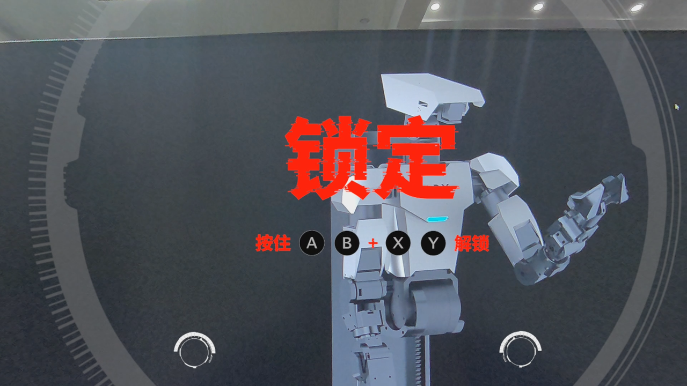

此时VR会一直发出锁定的声音
而后双手按住手柄的AB+ XY解锁
## 3. 整解锁
而后同时长按 左右摇杆键（直至语音提示控制器上线）机械臂完整解锁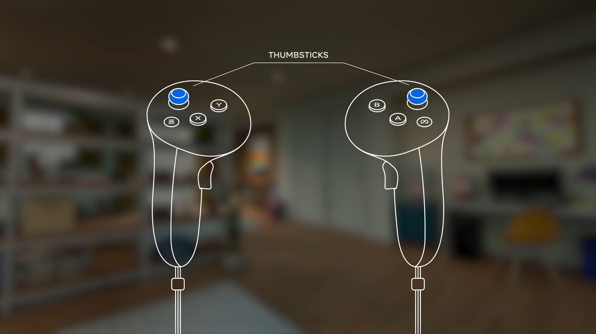
## 4. 复位
而后按`X`和`A`复位

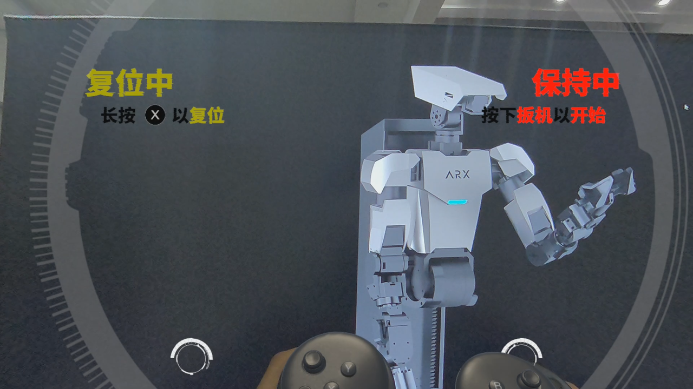

## 5. 操作
按住`扳机`开始进行遥操作
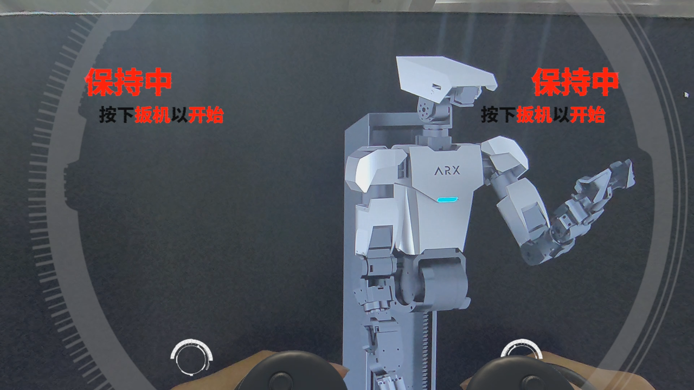
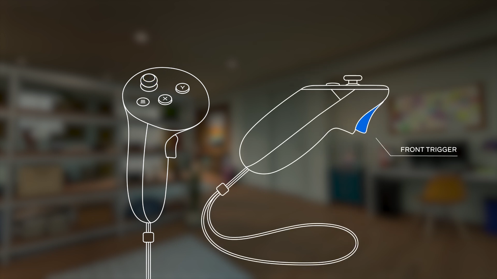

## 6. 夹爪
按两侧按钮控制夹爪开合
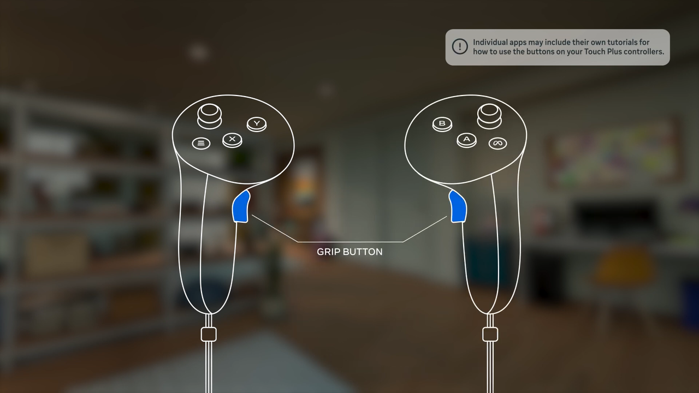

## 7. exit VR APP
<font color=#FF0000 >VR使用之后一定要退出VR APP，否则可能会在使用中出现初始位姿错误的情况 </font>

按右手柄上的Meta图标按钮可以进入后台，然后使用手柄让APP退出